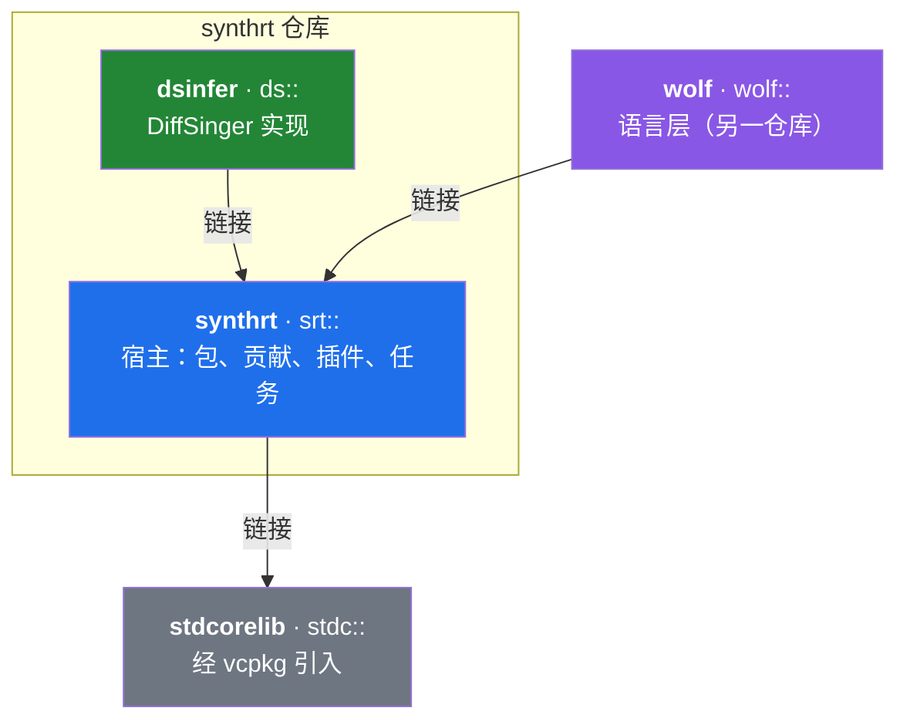
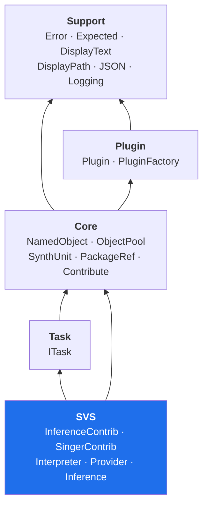
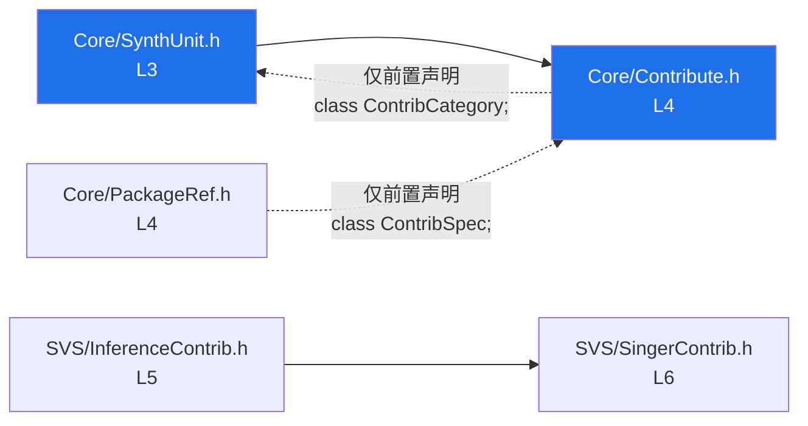
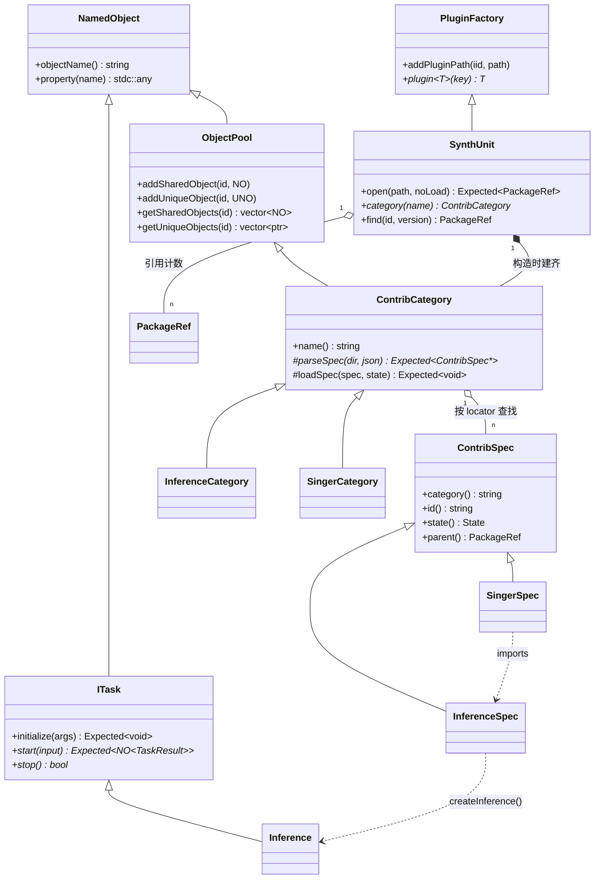
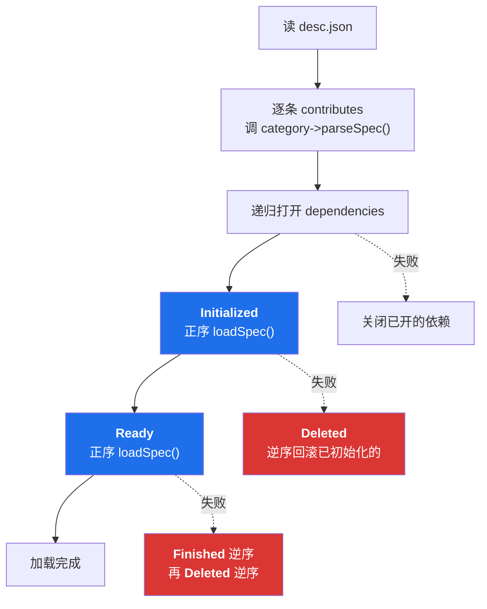
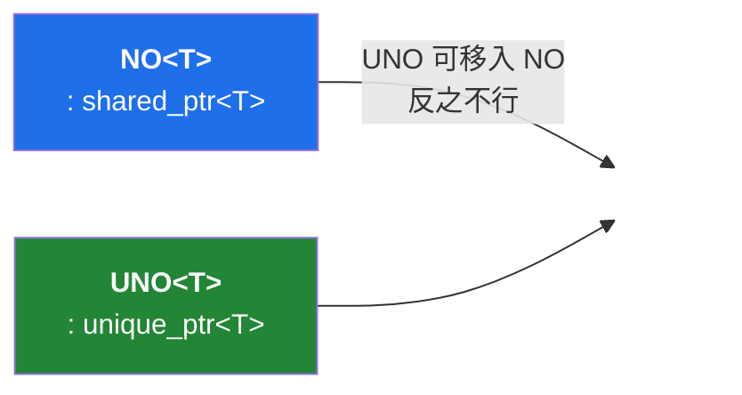
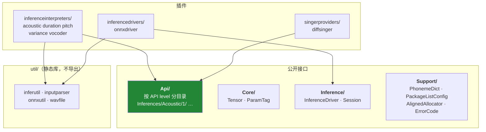

# synthrt 架构

> 依据 `main` 分支实际代码整理（`3c962f6`），不是设计意图的复述。
> 头文件层级由 `#include` 关系算出。

---

## 一、三个仓库的位置



`srt::` 不认识歌声合成之外的任何东西，也不认识 DiffSinger。
`ds::` 和 `wolf::` 都是**从外面插上来的**——走的是同一组扩展点（第六节）。

`JsonValue`、`any`、`VersionNumber`、`SharedLibrary`、`StaticRegistry` 全在 stdcorelib，
synthrt 侧 `Support/JSON.h` 只剩三个 `using`。

---

## 二、synthrt 内部分层



**这里只有一条需要记住的规则**：`SVS` 是唯一知道「推理」和「歌手」这两个概念的层。
`Core` 只知道有「若干种贡献」，具体是哪几种由注册表在运行期决定——
所以 wolf 能加一个 `language` 类别而不必改 `Core` 一行。

---

## 三、头文件层级

24 个公开头文件，严格 DAG，**同层之间互不包含**。

| 层 | 头文件 | 依赖的上一层 |
|---|---|---|
| **0** | `synthrt_global.h` | 仅 `stdcorelib/stdc_global.h` |
| | `Support/JSON.h` | 仅 `stdcorelib/support/json.h` |
| **1** | `Support/Error.h` | `synthrt_global` |
| | `Support/Logging.h` | `synthrt_global`（叶子，无人包含） |
| | `Core/NamedObject.h` | `synthrt_global` |
| | `Plugin/Plugin.h` | `synthrt_global` |
| **2** | `Support/Expected.h` | `Error` |
| | `Core/NamedObject_p.h` | `NamedObject` |
| | `Plugin/PluginFactory.h` | `Plugin` |
| **3** | `Support/DisplayText.h` | `Expected` `JSON` |
| | `Support/DisplayPath.h` | `Expected` `JSON` |
| | `Core/SynthUnit.h` | `PluginFactory` `Expected` |
| | `Plugin/PluginFactory_p.h` | `PluginFactory` |
| | `Task/ITask.h` | `NamedObject` `Expected` |
| **4** | `Core/PackageRef.h` | `DisplayText` `DisplayPath` `Expected` |
| | `Core/Contribute.h` | `SynthUnit` `NamedObject` `Expected` `JSON` |
| | `SVS/Inference.h` | `ITask` |
| **5** | `Core/Contribute_p.h` | `Contribute` `NamedObject_p` |
| | `SVS/InferenceContrib.h` | `Contribute` `DisplayText` |
| **6** | `SVS/InferenceInterpreter.h` | `InferenceContrib` |
| | `SVS/SingerContrib.h` | `InferenceContrib` `Contribute` `DisplayPath/Text` |
| **7** | `SVS/InferenceInterpreterPlugin.h` | `InferenceInterpreter` `Plugin` |
| | `SVS/SingerProvider.h` | `SingerContrib` |
| **8** | `SVS/SingerProviderPlugin.h` | `SingerProvider` `Plugin` |

### 三处值得注意的边



1. **`SynthUnit` 比 `Contribute` 低一层**，靠 `SynthUnit.h` 里的前置声明断开——
   否则两者互相包含。`SynthUnit` 只需要知道「有 `ContribCategory` 这个东西」。
2. **`PackageRef` 完全不包含 `Contribute.h`**，只前置声明 `ContribSpec`，
   所以 `contributes()` 返回的是裸指针的 vector。
3. **`SingerContrib` 包含 `InferenceContrib`**，方向是单向的：歌手引用推理，推理不知道歌手。

### `_p` 后缀在这里不是「私有」

| 位置 | 文件 | 含义 |
|---|---|---|
| `include/synthrt/` | `Contribute_p.h` `NamedObject_p.h` `PluginFactory_p.h` | **随库安装**。外部库要派生自己的贡献类别，必须拿到 `ContribSpec::Impl` / `ContribCategory::Impl` |
| `lib/` | `PackageRef_p.h` `SynthUnit_p.h` `ITask_p.h` | 真正只在库内 |

wolf 的 `LanguageCategory` 就是靠前一组实现的。这三个 `Impl` 都带 `SYNTHRT_EXPORT`。

---

## 四、核心对象关系



**`SynthUnit` 同时是 `PluginFactory`**——它既管包也管插件，因为贡献的加载过程需要
按 `className` 去取插件（第五节）。

---

## 五、包加载：一个状态机，失败按相反顺序回滚

`SynthUnit::open(path, noLoad=false)` 的完整过程：



两个阶段各自做什么，以 `inference` / `singer` 为例：

| 阶段 | `InferenceCategory` | `SingerCategory` |
|---|---|---|
| **Initialized** | 按 `className` 取 `InferenceInterpreterPlugin`，缓存 interpreter；调 `createSchema()` / `createConfiguration()` | 按 `className` 取 `SingerProviderPlugin`，缓存 provider；调 `createConfiguration()` |
| **Ready** | — | 解析 `imports`：到 `inference` 类别里按 locator 找到 `InferenceSpec`，再调它的 `createImportOptions()` |

**为什么分两段**：`singer` 的 `Ready` 需要别的贡献已经就绪。
所有贡献先各自 `Initialized`，再统一进 `Ready`，跨贡献的引用才有东西可指。

> `ContribSpec::State` 有五个值，但 `Deleted` 只在回滚路径出现，
> 正常加载走的是 `Invalid → Initialized → Ready`。

---

## 六、扩展点

### 6.1 插件（运行期加载，按 IID + key 查找）

| IID | 接口 | 谁实现 |
|---|---|---|
| `org.openvpi.InferenceInterpreter` | `InferenceInterpreterPlugin` | dsinfer：acoustic / duration / pitch / variance / vocoder |
| `org.openvpi.SingerProvider` | `SingerProviderPlugin` | dsinfer：diffsinger |
| `org.openvpi.InferenceDriver` | `InferenceDriverPlugin`（**定义在 dsinfer**） | dsinfer：onnxdriver |
| `org.openvpi.LanguageProvider` | `LanguageProviderPlugin`（**定义在 wolf**） | wolf：cmn |

后两个说明扩展点本身也是可扩展的：**一个 IID 由谁定义，与它被谁加载无关**，
`PluginFactory::plugin<T>(key)` 只认 `T::IID`。

### 6.2 贡献类别（链接期注册）

```cpp
static ContribCategoryRegistry::Add<ContribCategoryFactory<SingerCategory>>
    registrar("singer", "Singer contributes");
```

> ⚠️ **这条路插件走不通。** `SynthUnit` 在构造时把注册表读一遍就建齐所有类别，
> 而插件是通过 `SynthUnit` 懒加载的——轮到插件跑静态初始化时，类别早就建完了。
> **贡献一个新类别是链接期依赖能做的事，插件不能。** wolf 是链接进来的，所以可以。

---

## 七、所有权约定



`ObjectPool` **有两个互不相通的集合**，因为「所有权」不是一件事：

| | 谁持有 | 查找返回 | 移除时 |
|---|---|---|---|
| `addSharedObject` | 池 + 别人 | `NO<NamedObject>`，调用方可以留着 | 对象可能还活着 |
| `addUniqueObject` | 只有池 | `NamedObject *`，只能借用 | 对象即刻销毁 |

同一个 id 在一个集合里注册，**在另一个集合里查不到**。

### 判据

> **能干净改成「持有者 + 借用者」的，共同点是持有者比借用者活得久。**

据此的实际归属：

| 对象 | 归属 | 理由 |
|---|---|---|
| `schema` / `configuration` | spec 持有 `UNO`，外部借裸指针 | spec 比用它的每个推理都活得久 |
| `interpreter` / `provider` | category 的缓存持有 `UNO` | 同上 |
| `driver` | 池持有，借用者裸指针 | 同上 |
| `XxxResult` | **维持 `NO`** | 结果比 task 活得久，本来就该可复制 |
| `ITensor` | **维持 `NO`** | 本来就是共享类型 |

---

## 八、dsinfer 侧的形状



`Api/` 的目录里带版本号（`Inferences/Acoustic/1/`），对应 `InferenceInfoBase::apiLevel()`——
**接口的版本是路径的一部分**，而不是靠字段协商。

---

## 附：一次推理的完整调用链

```mermaid
sequenceDiagram
    participant App as 调用方
    participant SU as SynthUnit
    participant SC as SingerCategory
    participant IS as InferenceSpec
    participant IT as InferenceInterpreter
    participant Inf as Inference : ITask
    participant Drv as InferenceDriver

    App->>SU: open(package, noLoad=false)
    SU->>SC: parseSpec / loadSpec(Initialized)
    SC->>IT: createConfiguration()
    SU->>SC: loadSpec(Ready)
    SC->>IS: createImportOptions()
    App->>SU: find(id).contribute("singer", "main")
    App->>IS: createInference(options)
    IS->>IT: createInference()
    IT-->>App: NO&lt;Inference&gt;
    App->>Inf: initialize(args) / start(input)
    Inf->>Drv: 会话执行
    Drv-->>Inf: 张量
    Inf-->>App: NO&lt;TaskResult&gt;
```
